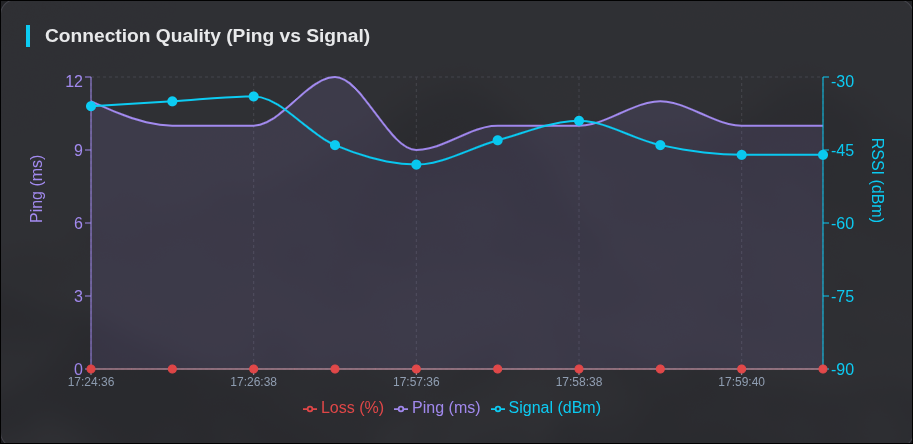
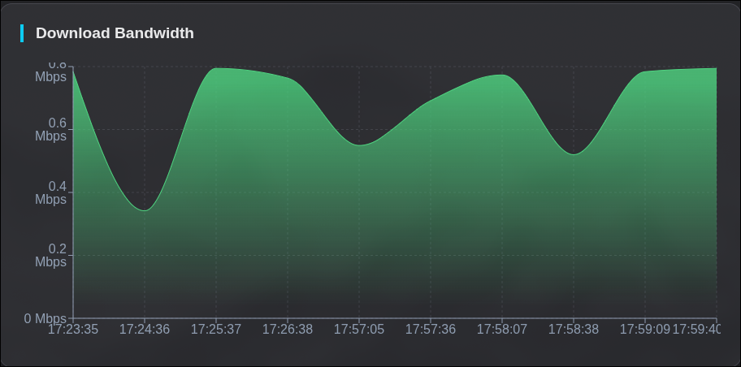

# 📡 IoT Network Telemetry Dashboard

A high-performance, real-time visualization dashboard for monitoring IoT device connectivity. Designed to track **Signal Strength (RSSI)**, **Latency**, **Packet Loss**, and **Bandwidth** for ESP32 and other embedded devices using a modern, dark-mode aesthetic.

---

## 📸 Dashboard Preview

### Connection Quality & Loss



### Bandwidth Monitor



Visualizes the correlation between **Signal Strength (dBm)**, **Latency (ms)**, and **Packet Loss** events in real time.

---

## ⚡ Features

### 📊 Multi-Axis Visualization

* **Composed Chart**: Correlates RSSI (Signal) vs Ping (Latency) using dual Y-axes.
* **Loss Detection**: Packet loss is automatically overlaid as red bars when instability is detected (via a hidden third axis).
* **Dynamic Scaling**: Chart domains automatically adjust to prevent clipping and ensure readability.

### 🚀 Dynamic Bandwidth Scaling

* Area charts with auto-scaling Y-axis domains based on real-time internet speeds (Mbps).
* Includes a **headroom algorithm** (`1.2x max value`) to keep charts visually breathable.

### 🔄 Real-Time Polling

* Auto-refreshes telemetry data every **5 seconds** without page reloads.
* Live system indicators:

    * Device uptime
    * Local IP address
    * Free system RAM

### 🎨 Responsive Dark UI

* Mobile-first design using **CSS Grid** and **Flexbox**.
* Custom tooltips and legends optimized for dark mode.
* High-contrast **"Cyber" aesthetic** for excellent visibility.

---

## 🛠 Tech Stack

* **Frontend**: React.js (Hooks, Context API)
* **Build Tool**: Vite
* **Charts**: Recharts (ComposedChart, AreaChart)
* **Networking**: Axios (REST API consumption)
* **Styling**: CSS Modules with a custom dark theme

---

## 🚀 Getting Started

### Prerequisites

* Node.js **v16+**
* npm or yarn

### 1. Clone the Repository

```bash
git clone https://github.com/your-username/telemetry-dashboard.git
cd telemetry-dashboard
```

### 2. Install Dependencies

```bash
npm install
```

### 3. Configure Environment

Edit `baseURL` in src/api/axios.js to define your backend API endpoint:

```
baseURL: 'https://iot-esp32-api-23ffc2af.azurewebsites.net/api'
```

### 4. Run the Development Server

```bash
npm run dev
```

The dashboard will be available at `http://localhost:5173` by default.

---

## 🔌 API Data Contract

The dashboard expects the backend to return an **array of telemetry objects** with the following structure:

```json
[
  {
    "id": "7b9c477a-b0fa-4656-9f16-33176dcbac2b",
    "timestamp": "2025-12-11T20:00:09.031",
    "deviceId": "esp32-01",
    "type": "TELEMETRY",
    "ssid": "NETWORK",
    "local_ip": "192.168.0.1",
    "rssi": -35, //Signal strength in dBm
    "ping_avg": 9, //Average latency in milliseconds
    "ping_jitter": 2, //Latency jitter in milliseconds
    "packet_loss": 0, //Packet loss percentage (0–100)
    "download_speed": 0.78, //Bandwidth in Mbps
    "uptime_seconds": 1988, //Device uptime in seconds
    "system_ram_free": 174064  //Free RAM in bytes
  }
]
```

## 📂 Project Structure

```text
src/
├── api/
│   └── axios.js               # Global Axios instance
├── components/
│   ├── NetworkHealthChart.jsx # Dual-axis RSSI / Ping / Loss chart
│   ├── SpeedChart.jsx         # Bandwidth area chart
│   └── StatCard.jsx           # Reusable metric cards (RAM, IP, etc.)
├── context/
│   └── AuthContext.jsx        # Authentication logic
├── pages/
│   └── Dashboard.jsx          # Main layout and data fetching
├── styles/
│   ├── Dashboard.css          # Global dashboard styles
│   └── Login.css              # Login page styles
└── App.jsx                    # Application routing
```
---
